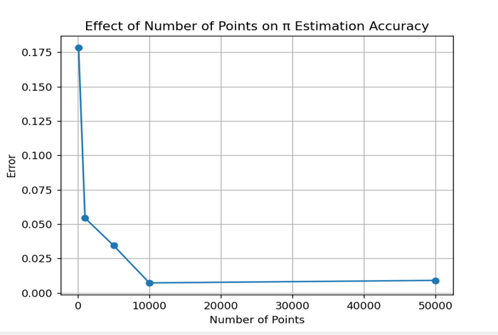
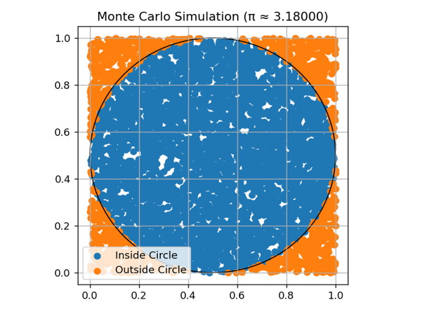

# Monte Carlo Pi Estimator

Estimate the value of **π (Pi)** using the **Monte Carlo simulation** method in Python.  
This project demonstrates how random sampling can be used to approximate mathematical constants while visualizing the simulation process and the effect of sample size on accuracy.

---

## Overview

The Monte Carlo method estimates π by randomly generating points inside a square and checking how many fall within an inscribed circle.

Since the ratio between the circle's area and the square's area is:

πr² / (2r)² = π / 4

We can estimate π using:

π ≈ 4 × (Points Inside Circle / Total Points)

---

## Features

-  Random point generation using **NumPy**
-  Monte Carlo approximation of π
-  Comparison between estimated and actual π
-  Error calculation
-  Visualization of points inside and outside the circle
-  Graph showing how increasing the number of samples improves accuracy

---

## Technologies Used

- Python 3
- NumPy
- Matplotlib

---

## Project Structure

```
.
├── monte_carlo_pi.py
├── README.md
└── screenshots
```

---

## Installation

Clone the repository:

```bash
git clone https://github.com/abderrahmane-imlouli/monte-carlo-pi-estimator.git
cd monte-carlo-pi-estimator
```

---

## Usage

Run the script:

```bash
python monte_carlo_pi.py
```

The program will:

1. Generate random points.
2. Estimate the value of π.
3. Compare it with Python's built-in value.
4. Display the estimation error.
5. Plot:
   - Random points inside and outside the circle.
   - Error versus number of sampled points.

---

## Example Output

```text
Estimated π: 3.1424
Real π: 3.141592653589793
Error: 0.000807346410207

Effect of number of points:
100 points   → π ≈ 3.080000 | Error = 0.061593
1000 points  → π ≈ 3.156000 | Error = 0.014407
5000 points  → π ≈ 3.142400 | Error = 0.000807
10000 points → π ≈ 3.141600 | Error = 0.000007
50000 points → π ≈ 3.141760 | Error = 0.000167
```
* Effect of Number of Points:

   

* Visualization:

   

  
---

## Educational Purpose

This project is intended for learning and demonstrating:

- Monte Carlo simulation
- Random sampling techniques
- Numerical approximation
- Data visualization with Matplotlib
- Scientific computing in Python

---

## Author 
imlouli abderrahmane
